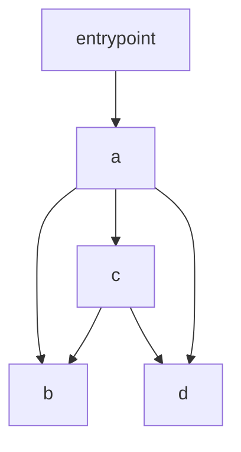
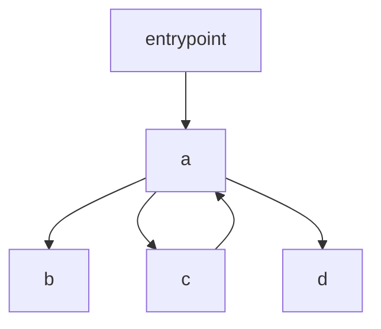
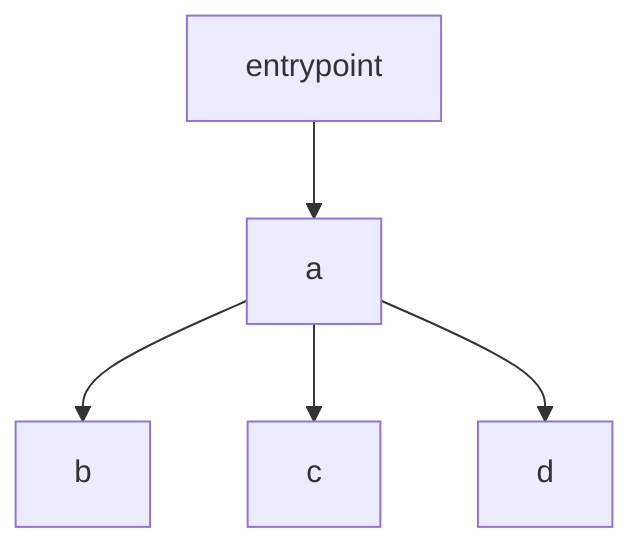
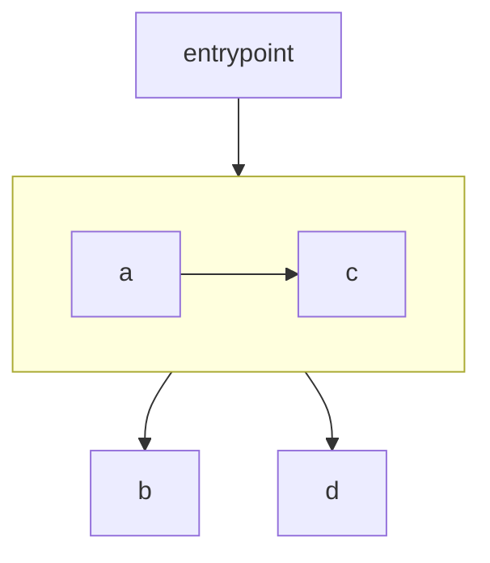
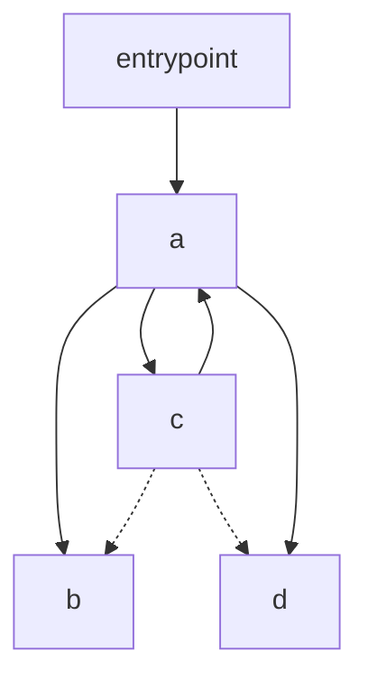
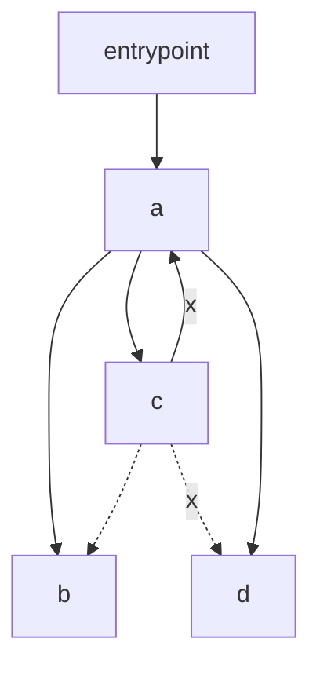
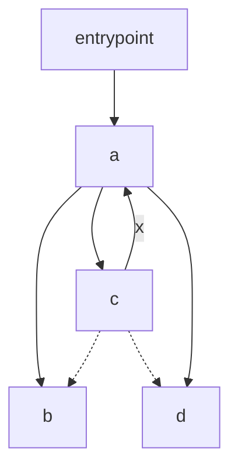

Suppose that you have the modules in `before/`. Since `a.js` re-exports from `b.js` and `d.js`, you decide to refactor `c.js` applying the following diff:

```diff
4,5c4
< import { b } from "./b.js";
< import { d } from "./d.js";
---
> import { b, d } from "./a.js";
```

This looks safe, however it changes the dependencies graph shape by introducing a new cycle: the execution order of your modules changes, causing a new TDZ error.

<table>
<tr><th colspan="2">Before</th><th colspan="2">After</th></tr>
<tr><th>Dependency graph</th><th>Execution order</th><th>Dependency graph</th><th>Execution order</th></tr>

<tr><td>



</td><td>

b, d, c, a

</td><td>



</td><td>

b, c, d, a

</td></tr>
</table>

This is because when executing the graph ECMAScript ignores any edge that would cause a cycle, and thus it executes _After_ as if it had this graph:



ECMAScript can solve this problem by considering strongly connected components (SCCs), and executing all the dependencies of the modules in the SCC that are not themself in the SCC first. The new execution graph would look like this:



And the execution order would be b, d, c, a again.

This changes ensures that all the transitive dependencies of every module are executed before it, unless such dependencies cyclically depend on that module.

---

<table>
<tr><th>Dependency graph</th><th>Transitive closure</th></tr>

<tr><td>


</td><td>



</td></tr>

<tr><th>Links currently broken during execution</th><th>Links broken during execution with this proposal</th></tr>

<tr><td>



</td><td>



</td></tr>
</table>
